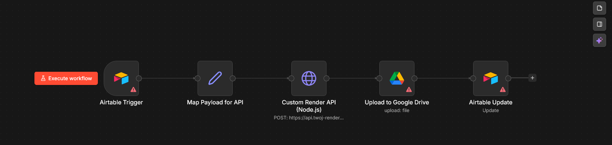

# 📄 Intelligent Document Automation Engine (n8n Orchestrator)
### Microservice-based architecture for high-volume DOCX & PDF generation.

<p align="center">
  
</p>

## 🎯 The Business Problem
Generating complex legal contracts, invoices, and reports manually is slow and error-prone. Standard "no-code" tools often fail when documents require dynamic tables, nested lists, or complex DOCX formatting.

## 💡 The Solution (Microservices Architecture)
To ensure scalability and perfect formatting, this system decouples the **Orchestration** from the **Rendering**.
This repository contains the **Orchestrator Engine (n8n)** which manages the state, triggers, and file distribution.

### 🏗️ How the Pipeline Works:
1. **Trigger:** `n8n` listens for status changes in Airtable/CRM.
2. **Payload Mapping:** Extracts raw data and builds a structured JSON payload.
3. **API Dispatch:** `n8n` sends a POST request to my custom **[Node.js Render Service](https://github.com/DudiRuders/document-render-service)**.
4. **Processing:** The external Node.js service merges the JSON data with a `.docx` template and converts it to `.pdf`.
5. **Distribution:** `n8n` receives the buffer, uploads the PDF to Google Drive, and syncs the URL back to Airtable.

---

## ⚙️ Data Flow Example
This is the payload generated by the n8n orchestrator and sent to the Render API:

```json
{
  "template_id": "b2b_contract_v2",
  "data": {
    "client_name": "Tech Corp LLC",
    "contract_value": "15,000.00 PLN",
    "services": [
      {"name": "API Integration", "price": "10,000 PLN"},
      {"name": "Maintenance", "price": "5,000 PLN"}
    ]
  }
}
