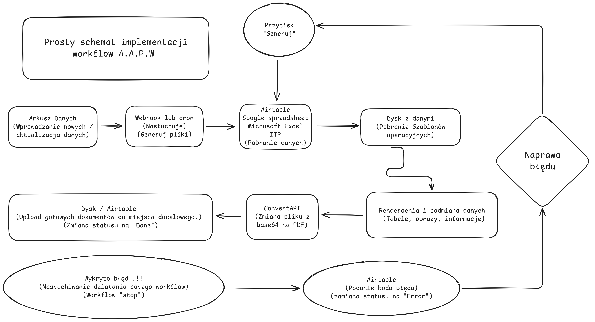

# A.A.P.W — Automation Map

Publiczna dokumentacja architektury i przepływu automatyzacji.  
Repo nie zawiera workflow produkcyjnych ani sekretów.

## Mapa workflow

## Co robi ten workflow?
- Trigger uruchamia proces (cron/webhook)
- Pobranie rekordów z Airtable (status: WORK)
- Walidacja + mapowanie pól na dokument
- Render DOCX (podmiana pól + obrazów)
- Konwersja DOCX → PDF
- Zapis DOCX/PDF do Google Drive
- Aktualizacja Airtable: DONE + linki
- Obsługa błędów: ERROR + log

## Integracje (bez sekretów)
- Airtable (źródło danych + statusy)
- Google Drive (szablony i wyniki)
- Render service (DOCX/PDF) — https://github.com/DudiRuders/AAEPW-render-service
- ConvertAPI (DOCX → PDF)

## Demo components

* Render service (DOCX/PDF): https://github.com/DudiRuders/AAEPW-render-service

## Failure modes (co może się wysypać)
- brak danych / błędne pola w rekordzie
- błąd renderowania dokumentu
- błąd konwersji do PDF
- błąd zapisu do Drive
- timeouty HTTP / limity API

## Security
- Brak tokenów i sekretów w repo
- Workflow produkcyjny pozostaje prywatny
- W publicznym repo są tylko diagramy i opis
